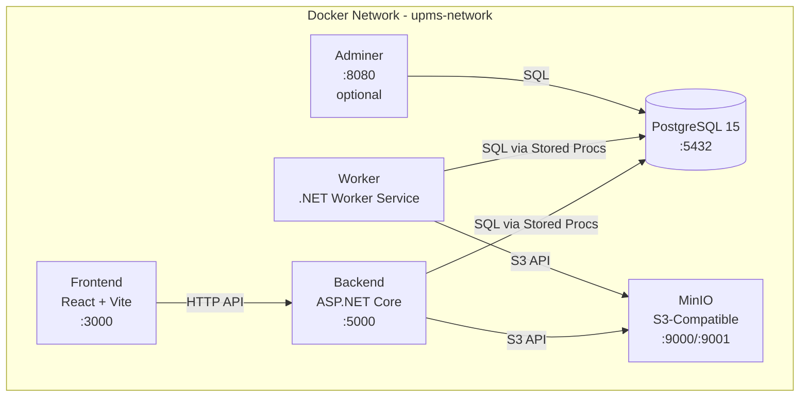
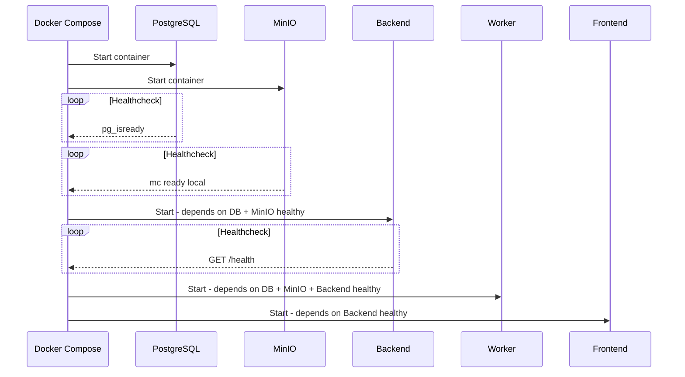

# Docker Environment & Project Structure Plan

## Overview
This document outlines the Docker-first development environment for the **Snapshot-Based Reporting & Analysis Platform (UPMS)**.

---

## Container Architecture



---

## Services Configuration

### 1. Database - `db`
| Property | Value |
|----------|-------|
| Image | `postgres:15-alpine` |
| Port | `5432` (configurable via `DB_PORT`) |
| Volume | `postgres_data:/var/lib/postgresql/data` |
| Init Scripts | `./sql/migrations` mounted to `/docker-entrypoint-initdb.d` |
| Healthcheck | `pg_isready -U $POSTGRES_USER -d $POSTGRES_DB` |

### 2. Object Storage - `minio`
| Property | Value |
|----------|-------|
| Image | `minio/minio:latest` |
| API Port | `9000` (configurable via `MINIO_API_PORT`) |
| Console Port | `9001` (configurable via `MINIO_CONSOLE_PORT`) |
| Volume | `minio_data:/data` |
| Healthcheck | `mc ready local` |

### 3. Backend API - `backend`
| Property | Value |
|----------|-------|
| Build Context | `./docker/backend/Dockerfile` |
| Internal Port | `8080` |
| External Port | `5000` (configurable via `BACKEND_PORT`) |
| Dependencies | `db` (healthy), `minio` (healthy) |
| Healthcheck | `curl -f http://localhost:8080/health` |

### 4. Background Worker - `worker`
| Property | Value |
|----------|-------|
| Build Context | `./docker/worker/Dockerfile` |
| Dependencies | `db` (healthy), `minio` (healthy), `backend` (healthy) |
| No exposed ports | Internal communication only |

### 5. Frontend - `frontend`
| Property | Value |
|----------|-------|
| Build Context | `./docker/frontend/Dockerfile` |
| Port | `3000` (configurable via `FRONTEND_PORT`) |
| Volume Mount | `./src/Frontend:/app` for hot reload |
| Dependencies | `backend` (healthy) |

### 6. Adminer - `adminer` (Optional)
| Property | Value |
|----------|-------|
| Image | `adminer:latest` |
| Port | `8080` (configurable via `ADMINER_PORT`) |
| Profile | `tools` - only starts with `--profile tools` |
| Dependencies | `db` (healthy) |

---

## Environment Variables

### Database Configuration
| Variable | Default | Description |
|----------|---------|-------------|
| `POSTGRES_USER` | `upms` | PostgreSQL username |
| `POSTGRES_PASSWORD` | `upms_dev_password` | PostgreSQL password |
| `POSTGRES_DB` | `upms` | Database name |
| `DB_PORT` | `5432` | Host port for PostgreSQL |

### MinIO Configuration
| Variable | Default | Description |
|----------|---------|-------------|
| `MINIO_ROOT_USER` | `minioadmin` | MinIO root username |
| `MINIO_ROOT_PASSWORD` | `minioadmin123` | MinIO root password |
| `MINIO_API_PORT` | `9000` | Host port for MinIO API |
| `MINIO_CONSOLE_PORT` | `9001` | Host port for MinIO Console |
| `MINIO_BUCKET` | `upms-artifacts` | Default bucket name |

### Service Ports
| Variable | Default | Description |
|----------|---------|-------------|
| `BACKEND_PORT` | `5000` | Host port for backend API |
| `FRONTEND_PORT` | `3000` | Host port for frontend dev server |
| `ADMINER_PORT` | `8080` | Host port for Adminer UI |

### ASP.NET Core Configuration
| Variable | Default | Description |
|----------|---------|-------------|
| `ASPNETCORE_ENVIRONMENT` | `Development` | ASP.NET environment |
| `VITE_API_BASE_URL` | `http://localhost:5000` | API URL for frontend |

---

## Project Folder Structure

```
UPMS/
├── docker-compose.yml          # Main orchestration file
├── .env.example                # Environment variable template
├── .env                        # Local environment - NOT committed
├── .gitignore                  # Git ignore rules
├── README.md                   # Project documentation
│
├── src/
│   ├── Backend/                # ASP.NET Core Web API
│   │   ├── Backend.csproj
│   │   ├── Program.cs
│   │   ├── Controllers/
│   │   ├── Services/
│   │   └── appsettings.json
│   │
│   ├── Worker/                 # .NET Worker Service
│   │   ├── Worker.csproj
│   │   ├── Program.cs
│   │   └── Workers/
│   │
│   └── Frontend/               # React + TypeScript + Vite
│       ├── package.json
│       ├── vite.config.ts
│       ├── tsconfig.json
│       ├── index.html
│       └── src/
│           ├── main.tsx
│           ├── App.tsx
│           └── components/
│
├── sql/
│   ├── migrations/             # Database migrations - run on init
│   │   ├── 001_create_raw_snapshot.sql
│   │   ├── 002_create_snapshot_ticket.sql
│   │   ├── 003_create_field_change.sql
│   │   └── 004_create_indexes.sql
│   │
│   └── stored-procedures/      # Stored procedures
│       ├── get_tickets_as_of.sql
│       ├── get_fields_for_ticket.sql
│       └── batch_reconstruct.sql
│
├── docker/
│   ├── backend/
│   │   └── Dockerfile          # Backend container definition
│   │
│   ├── worker/
│   │   └── Dockerfile          # Worker container definition
│   │
│   └── frontend/
│       └── Dockerfile          # Frontend dev container definition
│
├── plans/                      # Architecture and planning docs
│   └── docker-environment.md   # This document
│
└── Docs/                       # Project documentation
    ├── Project Overview.md
    ├── Technical Architecture.md
    ├── Environment.md
    └── Build Stages.md
```

---

## Startup Order & Health Dependencies



---

## Usage Commands

### Start All Services
```bash
docker compose up -d
```

### Start with Database Admin UI
```bash
docker compose --profile tools up -d
```

### View Logs
```bash
docker compose logs -f backend
docker compose logs -f worker
```

### Rebuild Specific Service
```bash
docker compose build backend
docker compose up -d backend
```

### Reset Database - Development Only
```bash
docker compose down -v
docker compose up -d
```

### Run Database Migrations Manually
```bash
docker compose exec db psql -U upms -d upms -f /docker-entrypoint-initdb.d/001_create_raw_snapshot.sql
```

---

## Network Communication

All services communicate via the `upms-network` Docker bridge network:

| From | To | Protocol | Address |
|------|-----|----------|---------|
| Backend | PostgreSQL | TCP/SQL | `db:5432` |
| Backend | MinIO | HTTP/S3 | `minio:9000` |
| Worker | PostgreSQL | TCP/SQL | `db:5432` |
| Worker | MinIO | HTTP/S3 | `minio:9000` |
| Frontend | Backend | HTTP | `backend:8080` (internal) / `localhost:5000` (browser) |
| Adminer | PostgreSQL | TCP/SQL | `db:5432` |

---

## Files to Create

The following files need to be created to implement this plan:

1. **`docker-compose.yml`** - Main orchestration file with all services
2. **`.env.example`** - Template for environment variables
3. **`README.md`** - Updated with project structure and setup instructions
4. **`docker/backend/Dockerfile`** - Backend container definition
5. **`docker/worker/Dockerfile`** - Worker container definition
6. **`docker/frontend/Dockerfile`** - Frontend dev container definition

---

## Next Steps

After creating the Docker environment files:

1. **Stage 1**: Create PostgreSQL schema and stored procedures in `sql/migrations/`
2. **Stage 2**: Scaffold the ASP.NET Core backend in `src/Backend/`
3. **Stage 3**: Scaffold the Worker service in `src/Worker/`
4. **Stage 4**: Scaffold the React frontend in `src/Frontend/`
